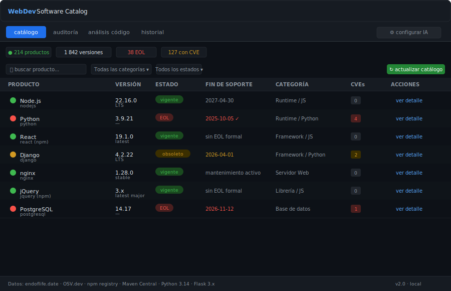
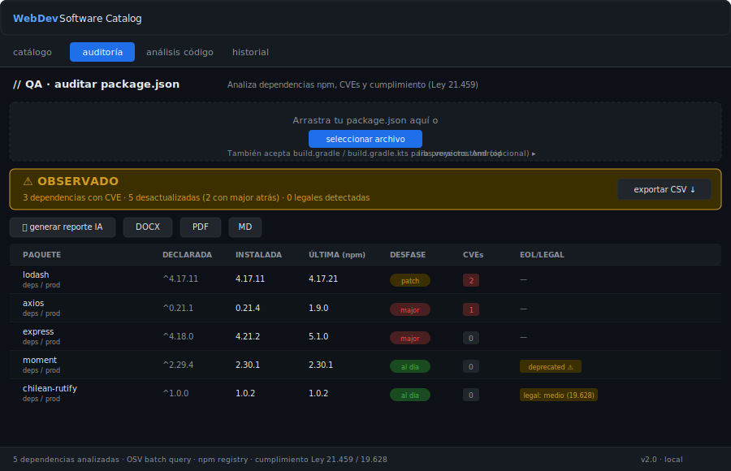
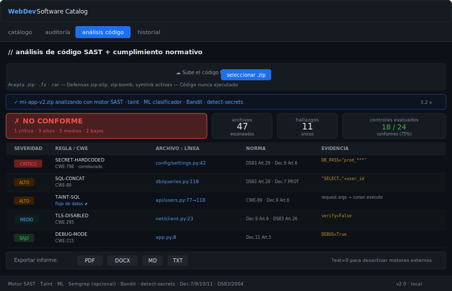
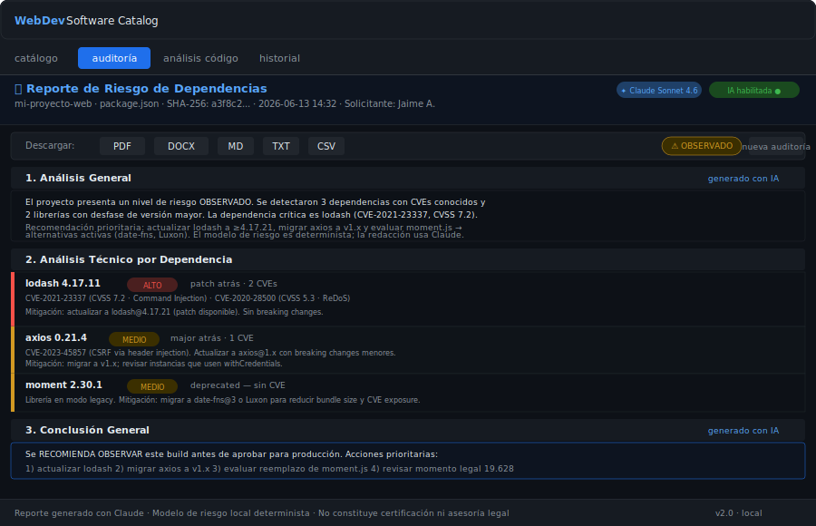

# WebDev Software Catalog

Dashboard de inventario y auditoría de software orientado al stack de desarrollo web. Combina ciclos de vida de versiones (EOL), CVEs en vivo y análisis estático de código fuente con cumplimiento de la normativa chilena de Transformación Digital del Estado.

> **Herramienta de uso local.** No requiere servicios en la nube ni suscripciones (salvo la API de Anthropic, opcional para redacción IA de reportes).

---

## Capturas de pantalla

### Catálogo de software

*Vista principal: 214+ productos web con versiones, estado EOL, categoría y CVEs. Datos en vivo desde endoflife.date, npm registry y OSV.dev.*

### Auditoría de dependencias (package.json / build.gradle)

*Análisis de package.json o build.gradle con veredicto QA, desfase de versiones, CVEs por dependencia y cumplimiento legal (Ley 21.459 / 19.628).*

### Análisis estático de código (SAST)

*SAST multicapa: motor propio + taint analysis + clasificador ML + motores OSS opcionales (Semgrep, Bandit, njsscan, detect-secrets, Gitleaks, Trivy). Hallazgos mapeados a Decretos 7/9/10/11 y DS83/2004.*

### Reporte de riesgo con IA

*Reporte estructurado generado con Claude (Anthropic). Incluye análisis general, técnico por dependencia y conclusión exportable en PDF, DOCX, MD, TXT y CSV.*

---

## Características principales

| Módulo | Descripción |
|--------|-------------|
| **Catálogo** | 214+ productos web (lenguajes, runtimes, servidores, DB, frameworks, CMS, librerías JS) con versiones, EOL, LTS y CVEs |
| **Auditoría npm** | package.json → desfase, CVEs (OSV batch), veredicto QA, exportación CSV/PDF/DOCX |
| **Auditoría Gradle** | build.gradle / build.gradle.kts + Android SDK/AGP → Maven Central, Google Maven, OSV |
| **SAST** | Análisis de código fuente (.zip/.7z/.rar) con motor propio + taint + ML + motores externos opcionales |
| **Cumplimiento** | Marco normativo chileno: Dec. 7/9/10/11, DS83/2004, Ley 19.628, Ley 21.459 |
| **Reportes IA** | Claude redacta análisis narrativo; modelo de riesgo determinista siempre disponible sin API key |
| **Exportadores** | PDF (ReportLab), DOCX (python-docx), Markdown, TXT, CSV — 100% server-side |
| **Historial** | Auditorías guardadas en SQLite local con hash SHA-256, acceso a reporte y borrado individual |

---

## Requisitos

- **Python 3.10+** (probado con 3.14 en Windows 11)
- Acceso de red a: `endoflife.date`, `api.osv.dev`, `registry.npmjs.org`, `repo1.maven.org`
- Opcional: clave Anthropic para reportes redactados con IA

---

## Instalación

```bash
# 1. Clonar el repositorio
git clone https://github.com/jarayaa/webdev_catalog.git
cd webdev_catalog

# 2. Instalar dependencias base
pip install -r requirements.txt

# 3. (Opcional) Motores SAST avanzados
pip install -r requirements-advanced.txt

# 4. Configurar variables de entorno
copy .env.example .env        # Windows
# cp .env.example .env        # macOS / Linux
# Edita .env y agrega ANTHROPIC_API_KEY si quieres reportes con IA
```

En redes corporativas con proxy o CA de inspección TLS (Zscaler, etc.):

```bash
pip install --proxy http://HOST:PUERTO -r requirements.txt
# truststore ya está en requirements.txt — usa el almacén de certificados del SO automáticamente
```

---

## Uso

```bash
# Desarrollo
python app.py
# → http://127.0.0.1:5001

# Producción (Windows, recomendado)
waitress-serve --threads=16 --port=5001 app:app
```

En el primer arranque el catálogo se descarga automáticamente. El botón **↻ actualizar catálogo** refresca los datos desde internet.

### Con autenticación (entorno compartido)

```bash
# Generar token
python -c "import secrets; print(secrets.token_hex(32))"

# Exportar antes de arrancar
set WEBDEV_AUTH_TOKEN=<token>          # Windows cmd
$env:WEBDEV_AUTH_TOKEN = "<token>"    # PowerShell
export WEBDEV_AUTH_TOKEN=<token>      # bash

python app.py
```

Todas las rutas `/api/*` exigirán `Authorization: Bearer <token>` o `X-Auth-Token: <token>`. La interfaz web lo pide automáticamente al cargar.

---

## Variables de entorno

| Variable | Requerida | Descripción |
|----------|-----------|-------------|
| `ANTHROPIC_API_KEY` | No | Clave de API Anthropic para redacción IA de reportes. Tiene precedencia sobre `config.json`. |
| `WEBDEV_AUTH_TOKEN` | No | Token Bearer para proteger la interfaz en entornos compartidos. Sin él, sin autenticación. |
| `HTTPS_PROXY` / `HTTP_PROXY` | No | Proxy corporativo. Alternativa al panel de configuración de la UI. |
| `WEBDEV_MAX_JSON_BYTES` | No | Límite de respuesta JSON de APIs externas (bytes). Por defecto: `8388608` (8 MB). |
| `WEBDEV_MAX_DEPS` | No | Máximo de dependencias por auditoría. Por defecto: `2000`. |
| `WEBDEV_MAX_UPLOAD_BYTES` | No | Tamaño máximo de archivo subido. Por defecto: `2097152` (2 MB). |
| `WEBDEV_MAX_WORKERS` | No | Hilos de auditoría paralela. Por defecto: `8`. |

Ver [`.env.example`](.env.example) para referencia completa.

---

## Estructura del proyecto

```
webdev_catalog/
├── app.py                  # Servidor Flask (rutas, seguridad, rate limiting, CSRF)
├── net.py                  # Cliente HTTP con truststore, reintentos, caché TTL
├── catalog_data.py         # Mapa de productos endoflife.date y librerías npm
├── osv.py                  # Consultas OSV.dev (batch, caché)
├── code_scan.py            # Motor SAST principal (patrones, CWE, norma)
├── taint.py                # Análisis de flujo de datos intra-archivo
├── ml_secrets.py           # Clasificador ML de verosimilitud de secretos
├── sast_external.py        # Integración Semgrep / Bandit / njsscan / detect-secrets / Gitleaks / Trivy
├── compliance.py           # Marco normativo chileno (Decretos 7/9/10/11, DS83)
├── regulatory.py           # Catálogo de controles auditables
├── report.py               # Generación de reportes (estructura, secciones)
├── exporters.py            # Exportadores PDF / DOCX / MD / TXT / CSV
├── archive_extract.py      # Extracción segura (.zip/.7z/.rar) con anti-bomb/slip
├── gradle_audit.py         # Parser Gradle + Maven Central + Google Maven
├── android_platform.py     # Evaluación SDK/AGP de Android
├── code_reason.py          # Razonamiento contextual sobre hallazgos
├── semgrep_rules.yml       # Ruleset Semgrep local (sin red)
├── requirements.txt        # Dependencias base
├── requirements-advanced.txt # Motores SAST opcionales
├── .env.example            # Plantilla de variables de entorno
├── templates/index.html    # UI (single-page, IBM Plex Mono)
├── static/
│   ├── css/style.css
│   └── js/app.js           # Fetch con CSRF automático, safeUrl, auth
└── docs/screenshots/       # Mockups SVG para documentación
```

---

## Seguridad

### Medidas implementadas

| Área | Control |
|------|---------|
| **Secretos** | `ANTHROPIC_API_KEY` en variable de entorno; `config.json` en `.gitignore` |
| **CSRF** | Double-submit cookie (SameSite=Strict); validado en todos los POST/PUT/DELETE |
| **Autenticación** | Bearer token opcional (`WEBDEV_AUTH_TOKEN`); comparación en tiempo constante |
| **Rate limiting** | Flask-Limiter por IP: refresh 3/min, audit 30/min, report 10/min, codescan 5/min |
| **Cabeceras HTTP** | CSP, HSTS, X-Frame-Options DENY, X-Content-Type-Options, Referrer-Policy, Permissions-Policy |
| **Uploads** | `secure_filename`, límite de tamaño, defensas zip-slip / zip-bomb / symlink |
| **Base de datos** | Consultas parametrizadas, WAL mode, `PRAGMA foreign_keys=ON`, `secure_delete=ON` |
| **Red** | SSRF: esquema de proxy validado (http/https/socks4/socks5); TLS verificado con truststore |
| **Respuestas** | Errores 500/413 en JSON sin trazas de pila; logging estructurado |
| **Archivos** | Código extraído nunca ejecutado; directorio temporal aislado eliminado al terminar |

### Archivos excluidos de git

`config.json`, `catalog.db`, `catalog.db-wal`, `catalog.db-shm` están en `.gitignore` y **nunca se publican**.

### SAST sobre el propio proyecto

Este repositorio ha sido auditado con su propio motor SAST. No se detectaron secretos embebidos, SQL sin parametrizar ni TLS deshabilitado en el código fuente publicado.

---

## Fuentes de datos

| Fuente | Uso |
|--------|-----|
| [endoflife.date](https://endoflife.date) | Ciclos de vida de lenguajes, runtimes, servidores, DB, CMS |
| [OSV.dev](https://osv.dev) | CVEs por ecosistema (npm, PyPI, Maven, Packagist) — consulta batch |
| [npm registry](https://registry.npmjs.org) | Última versión, fecha de publicación, metadatos de librerías JS |
| [Maven Central](https://search.maven.org) | Última versión de dependencias Java/Android |
| [Google Maven](https://dl.google.com/dl/android/maven2) | androidx, AGP y librerías Google |

---

## Marco normativo (SAST)

El análisis de código evalúa cumplimiento artículo a artículo de:

- **Decreto 7/2023** — Norma Técnica de Seguridad (Ley 21.180): Identificar, Proteger, Detectar, Responder, Recuperar
- **Decreto 9/2023** — Autenticación: OpenID Connect/OAuth 2.0, cifrado Bcrypt/Argon2, TLS 1.2+, trazabilidad en UTC
- **Decreto 10/2023** — Documentos y Expedientes Electrónicos
- **Decreto 11/2023** — Calidad y Funcionamiento de Plataformas
- **DS 83/2004** — Seguridad del Documento Electrónico: Arts. 6, 26, 28, 29, 31-32
- **Ley 19.628** — Protección de datos personales
- **Ley 21.459** — Delitos informáticos

---

## Análisis avanzado: motores SAST de código abierto (opcional)

El motor propio se robustece con motores de la industria que se **autodetectan** en
el `PATH`. Si no están instalados, la app funciona igual. Cada uno cubre una
**dimensión distinta** para lograr defensa en profundidad:

| Motor | Tipo | Dimensión que aporta | Instalación |
|-------|------|----------------------|-------------|
| **Semgrep** | SAST multi-lenguaje | Reglas locales offline ([semgrep_rules.yml](semgrep_rules.yml)) alineadas a la norma | `pip` |
| **Bandit** | SAST Python | Patrones inseguros en código Python | `pip` |
| **njsscan** | SAST Node/JS | Patrones inseguros en JavaScript/Node (eval, XSS, etc.) | `pip` |
| **detect-secrets** | Secretos | Detección por entropía y plugins (Yelp) | `pip` |
| **Gitleaks** | Secretos | Reglas + entropía, motor independiente que corrobora a detect-secrets | binario (Go) |
| **Trivy** | SCA + secretos + IaC | Dependencias vulnerables (CVE), secretos y misconfiguración Docker/k8s | binario (Go) |

```bash
# Motores pip
pip install -r requirements-advanced.txt
# Instala: semgrep · bandit · detect-secrets · njsscan

# Motores binarios (Windows)
winget install Gitleaks.Gitleaks
winget install AquaSecurity.Trivy
```

Cuando dos o más motores coinciden en el mismo hallazgo (mismo archivo/línea/CWE, o
mismo CVE en SCA), se marca como **corroborado** (mayor confianza) en vez de
duplicarse. Todos los hallazgos se normalizan al mismo esquema (severidad,
evidencia enmascarada, CWE, controles normativos y contexto), independientemente
del motor de origen.

> Verificado en este proyecto: Gitleaks y Trivy detectaron y corroboraron secretos
> embebidos junto al motor interno, y Trivy reportó 7 CVEs distintos de una
> dependencia npm desactualizada (SCA). njsscan requiere Python ≤ 3.13 (su
> dependencia `pydantic-core` aún no publica wheel para 3.14).

---

## Personalización

### Agregar productos con EOL

Edita `WEBDEV_CATEGORIES` en `catalog_data.py`:

```python
WEBDEV_CATEGORIES = {
    "mi-producto": "Mi Categoría",   # slug de endoflife.date → categoría
    ...
}
```

### Agregar librerías npm

Edita `NPM_LIBRARIES` en `catalog_data.py`:

```python
NPM_LIBRARIES = {
    "mi-libreria": ("Mi Librería", "Categoría"),
    ...
}
```

### Agregar mapeo CVE (OSV)

Edita `OSV_MAP` en `catalog_data.py`:

```python
OSV_MAP = {
    "mi-producto": ("npm", "mi-paquete"),   # ecosistema + nombre en OSV
    ...
}
```

---

## Rendimiento

- Auditoría **paralela** (ThreadPoolExecutor, `WEBDEV_MAX_WORKERS=8`)
- OSV en **lote** (`/v1/querybatch`): una petición para todas las dependencias
- Caché en memoria con TTL para metadata npm/Maven, OSV y JSON de APIs externas
- Pool de conexiones HTTP ampliado (24) con reintentos y backoff
- Refresh del catálogo con descargas en paralelo
- Frontend: debounce en filtros, `<select>` de categorías reconstruido solo si cambia

---

## Producción

```bash
# Windows (recomendado)
waitress-serve --threads=16 --port=5001 app:app

# Linux / macOS
gunicorn -w 4 -b 0.0.0.0:5001 app:app
```

Sirve siempre detrás de un proxy inverso (nginx, Caddy) que gestione TLS hacia los clientes.

---

## Licencia

MIT — ver [LICENSE](LICENSE) si existe, o usa libremente con atribución.

---

## Créditos

- [endoflife.date](https://endoflife.date) — API pública de ciclos de vida
- [OSV.dev](https://osv.dev) — Base de datos abierta de vulnerabilidades (Google)
- [Anthropic Claude](https://anthropic.com) — Modelo de lenguaje para redacción de reportes
- [Flask](https://flask.palletsprojects.com), [ReportLab](https://www.reportlab.com), [python-docx](https://python-docx.readthedocs.io), [truststore](https://github.com/sethmlarson/truststore)
